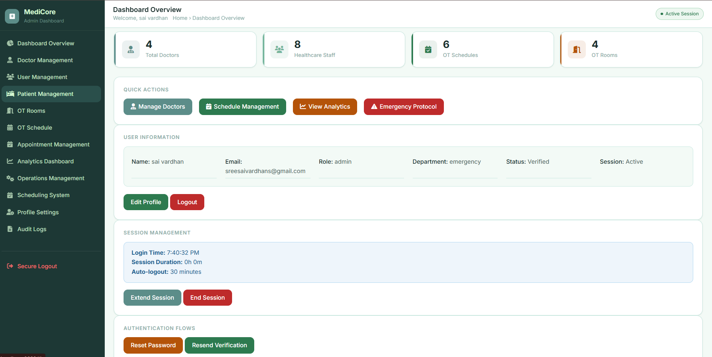
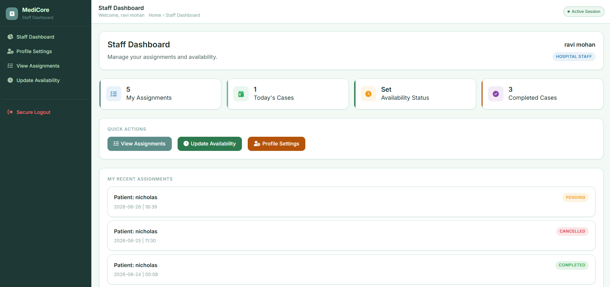
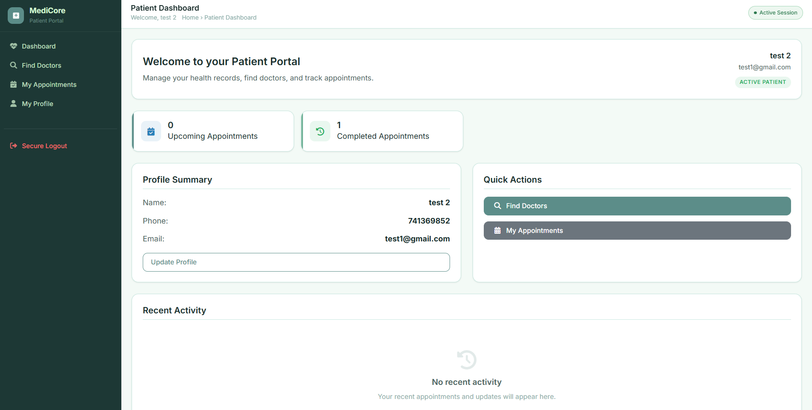
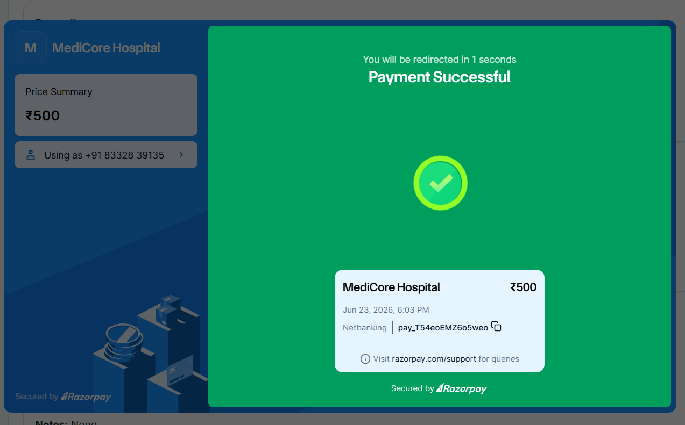
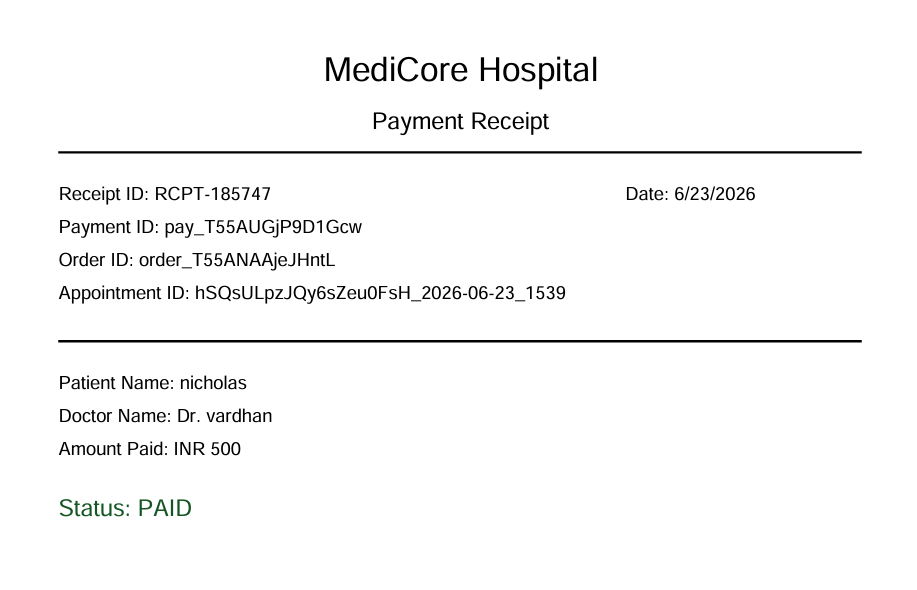

# Hospital Operation Scheduler 🏥

A full-stack hospital operations management platform that streamlines operation theater scheduling, appointment booking, doctor management, patient workflows, and secure payment processing through a real-time Firebase-powered architecture.

## Features

* Role-Based Authentication
* Doctor Management
* Patient Management
* Appointment Booking
* Conflict Detection
* Operation Theater Scheduling
* Real-Time Firestore Updates
* Razorpay Payment Integration
* Secure Payment Verification
* PDF Receipt Generation
* Responsive Mobile Design
* Admin Analytics & Management

## Tech Stack

**Frontend:**
* HTML
* CSS
* JavaScript

**Backend:**
* Firebase Authentication
* Firestore
* Cloud Functions

**Payments:**
* Razorpay

**Deployment:**
* Firebase Hosting / Netlify

## System Architecture

```text
Patient Books Appointment
          ↓
Create Razorpay Order
          ↓
Razorpay Checkout
          ↓
Cloud Function Verification
          ↓
Firestore Update
          ↓
PDF Receipt Generation
```

## Key Highlights

* Multi-role architecture (Admin, Doctor, Patient)
* Real-time Firestore synchronization
* Conflict-free appointment scheduling
* Secure Razorpay payment verification using Firebase Cloud Functions
* Automated PDF receipt generation
* Mobile-responsive dashboard and management modules
* Production-ready backend architecture with role-based security rules

## Payment Workflow

Appointment Booking → Razorpay Order Creation → Razorpay Checkout → Cloud Function Verification → Firestore Update → PDF Receipt

> **Note:** Currently configured in Razorpay Test Mode. Moving to Live Mode only requires replacing Razorpay Key ID and Key Secret in Firebase Secret Manager. No code changes are required.

## Screenshots

### Admin Dashboard


### Doctor Dashboard


### Patient Dashboard


### Payment Gateway


### Receipt Generation


## Future Improvements

* Live Razorpay production deployment
* Email and SMS appointment notifications
* Advanced analytics dashboard
* Inventory and equipment tracking
* Multi-hospital support

## Engineering Highlights

- Designed a role-based hospital management platform using Firebase Authentication and Firestore.
- Implemented conflict-free appointment scheduling with real-time updates.
- Integrated Razorpay payments with secure server-side verification using Firebase Cloud Functions.
- Developed responsive dashboards for Admin, Doctor, and Patient workflows.
- Built PDF receipt generation and payment tracking systems.